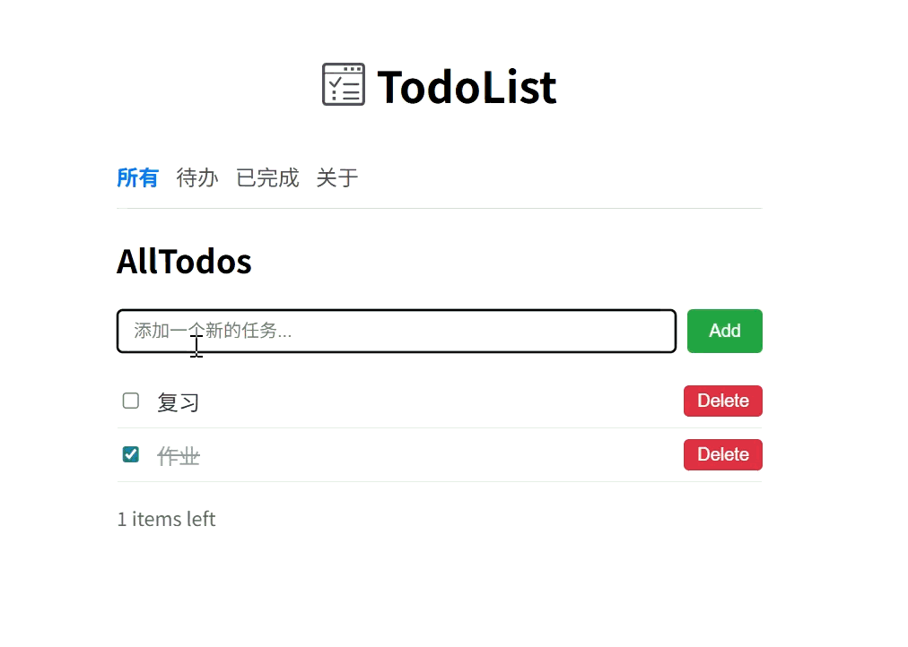

# React TodoDemo介绍

## 1.数据层 — context/TodoContext.jsx

用 createContext 创建全局上下文
useReducer 管理 todos[]，支持 ADD_TODO / TOGGLE_TODO / DELETE_TODO 三个action
TodoProvider 包裹整个应用，useTodoContext 暴露数据和 dispatch

## 2. 逻辑层 — hooks/useTodos.js

自定义 Hook，内部调用 useTodoContext 获取数据
封装 addTodo、toggleTodo、deleteTodo 方法
维护本地 filter state，提供 filteredTodos 计算属性

3. 视图层 — components/ + pages/
   Navbar: 使用 NavLink + isActive 高亮当前路由
   AddTodo: useState 管理输入框，提交时调 onAdd
   TodoItem: 单选按钮切换完成状态 + 删除按钮
   Home: 通过 useParams 读取路由参数，useEffect 同步到 filter，条件渲染列表
   About: 纯展示页

## 4. 路由 — App.jsx

/: all、/active、/completed 复用 Home 组件（靠 route param 区分）
/about → About 页面
未知路径重定向到 /
数据流: 用户在 AddTodo 输入 → dispatch ADD_TODO → reducer 更新 state → Context 通知所有消费者 → useTodos 重新计算 filteredTodos → Home 重新渲染列表
